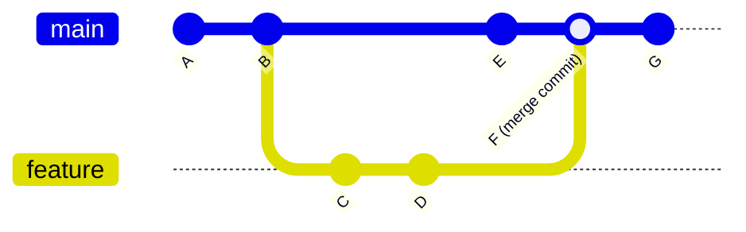
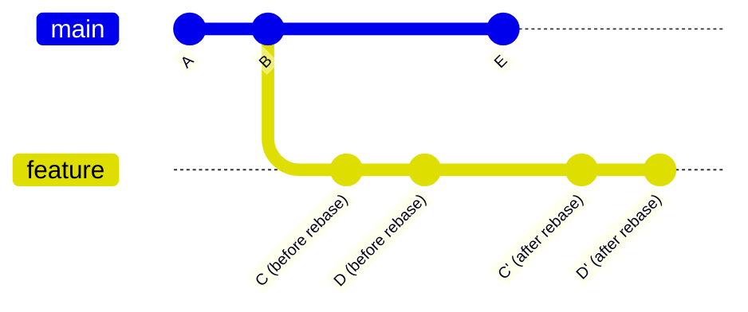
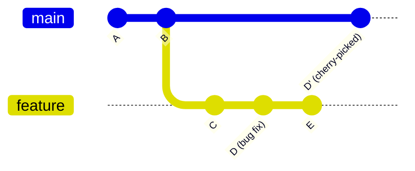

## 7. Git Operations Deep Dive: Merge vs Rebase vs Cherry-Pick

Understanding when and how to use different Git operations is crucial for maintaining a clean, efficient workflow. This section explains the three main operations and their best practices.

### 7.1 Git Merge

#### What It Does
Combines changes from one branch into another by creating a new "merge commit" that has two parents.

#### Visual Explanation


**Before Merge:**
```
main:     A---B---E
               \
feature:        C---D
```

**After Merge:**
```
main:     A---B---E---F (merge commit)
               \       /
feature:        C---D
```

#### When to Use Merge

| Scenario | Why Use Merge | Example |
|----------|--------------|---------|
| **Feature branches to main** | Preserves complete history, shows when feature was integrated | Merging `ST-XXX/FEAT/login` to `main` |
| **Long-lived branches** | Keeps branch history intact, easier to understand feature development | Merging week-long feature work |
| **Public branches** | Never rewrite public history | Merging `main` to `production` |
| **Team collaboration** | Multiple people working on same branch | Merging shared feature branch |

#### Best Practices

**✅ DO:**
```bash
# Update your branch before merging
git checkout main
git pull origin main

# Merge with descriptive message
git merge feature/user-auth --no-ff -m "Merge feature: Add user authentication"

# Use --no-ff to always create merge commit (better history)
git merge feature/payment --no-ff
```

**❌ DON'T:**
```bash
# Don't merge without pulling latest changes first
git merge feature/xyz  # Without updating main first

# Don't use merge for cleaning up personal feature branches
git merge main  # While on feature branch (use rebase instead)
```

#### Types of Merges

**Fast-Forward Merge (Default):**
```
main:     A---B
               \
feature:        C---D

After merge:
main:     A---B---C---D  (no merge commit, linear history)
```

**Non-Fast-Forward Merge (--no-ff):**
```
main:     A---B-------E (merge commit)
               \     /
feature:        C---D

Better for seeing feature boundaries!
```

---

### 7.2 Git Rebase

#### What It Does
Moves or combines commits to a new base, rewriting history to create a linear commit history.

#### Visual Explanation


**Before Rebase:**
```
main:     A---B---E
               \
feature:        C---D
```

**After Rebase:**
```
main:     A---B---E
                   \
feature:            C'---D' (commits replayed on top of E)
```

#### When to Use Rebase

| Scenario | Why Use Rebase | Example |
|----------|---------------|---------|
| **Updating feature branch** | Keep feature branch up-to-date with main, cleaner history | `git rebase main` while on feature branch |
| **Cleaning personal history** | Squash/reorganize commits before merging | Interactive rebase before PR |
| **Small features** | Linear history easier to understand | Feature branches < 3 days old |
| **Before creating PR** | Clean commit history for reviewers | Squash "WIP" and "fix typo" commits |

#### Best Practices

**✅ DO:**
```bash
# Update feature branch with latest main
git checkout feature/login
git rebase main

# Interactive rebase to clean up commits
git rebase -i HEAD~3  # Squash last 3 commits

# Rebase before opening PR
git checkout feature/payment
git rebase main  # Get latest changes
git push --force-with-lease origin feature/payment
```

**❌ DON'T:**
```bash
# NEVER rebase public/shared branches
git checkout main
git rebase feature/xyz  # ❌ Don't rewrite main's history!

# NEVER rebase commits already pushed and used by others
git rebase main  # If others are working on your branch

# Don't use regular force push (use --force-with-lease)
git push --force  # ❌ Can overwrite others' work
git push --force-with-lease  # ✅ Safer
```

#### Interactive Rebase (Powerful Tool)

```bash
git rebase -i HEAD~4

# Editor opens with:
pick abc1234 Add login form
pick def5678 Fix typo
pick ghi9012 Add validation
pick jkl3456 Fix another typo

# Change to:
pick abc1234 Add login form
squash def5678 Fix typo
pick ghi9012 Add validation
squash jkl3456 Fix another typo

# Result: 2 clean commits instead of 4
```

**Golden Rule of Rebase:**
> **Never rebase commits that have been pushed to a public/shared branch and that others may have based work on.**

---

### 7.3 Git Cherry-Pick

#### What It Does
Copies a specific commit from one branch and applies it to another branch, creating a new commit.

#### Visual Explanation


**Before Cherry-Pick:**
```
main:     A---B
               \
feature:        C---D (bug fix)---E
```

**After Cherry-Pick:**
```
main:     A---B---D' (copy of D)
               \
feature:        C---D (bug fix)---E

Note: D and D' have same changes but different commit hashes
```

#### When to Use Cherry-Pick

| Scenario | Why Use Cherry-Pick | Example |
|----------|--------------------| --------|
| **Hotfix from feature branch** | Need specific fix in production without merging entire feature | Cherry-pick critical bug fix commit |
| **Backporting fixes** | Apply fix to multiple release branches | Fix in v2.0, cherry-pick to v1.9 |
| **Selective deployment** | Only deploy specific commits, not entire branch | Your CHERRY-PICK deployment flow |
| **Undo mistakes** | Recover specific commit from wrong branch | Accidentally committed to wrong branch |

#### Best Practices

**✅ DO:**
```bash
# Cherry-pick single commit
git checkout production
git cherry-pick abc1234  # Copy commit abc1234 from another branch

# Cherry-pick with commit message edit
git cherry-pick abc1234 --edit

# Cherry-pick multiple commits
git cherry-pick abc1234 def5678 ghi9012

# Cherry-pick a range
git cherry-pick abc1234..ghi9012
```

**❌ DON'T:**
```bash
# Don't cherry-pick when you should merge the entire branch
git cherry-pick commit1 commit2 commit3 commit4  # Just merge the branch!

# Don't forget to test after cherry-picking
git cherry-pick abc1234
git push  # ❌ Test first!

# Don't cherry-pick without documenting
# Always note in commit message that it's cherry-picked
```

#### Cherry-Pick Best Practices

**Document Your Cherry-Picks:**
```bash
# Good practice: Add reference to original commit
git cherry-pick abc1234 -e

# In commit message, add:
# Cherry-picked from commit abc1234 on feature/login branch
# Original commit: "Fix authentication timeout issue"
```

**Handle Conflicts:**
```bash
git cherry-pick abc1234

# If conflicts occur:
# 1. Fix conflicts in files
# 2. Stage resolved files
git add .

# 3. Continue cherry-pick
git cherry-pick --continue

# Or abort if needed
git cherry-pick --abort
```

---

### 7.4 Comparison Matrix: Merge vs Rebase vs Cherry-Pick

| Aspect | Git Merge | Git Rebase | Git Cherry-Pick |
|--------|-----------|------------|-----------------|
| **History** | Preserves complete history | Rewrites history (linear) | Creates new commit (duplicate) |
| **Commit Graph** | Non-linear (shows merges) | Linear (cleaner) | Adds specific commits |
| **Use On Public Branches** | ✅ Yes, always safe | ❌ Never! Dangerous | ⚠️ Use carefully |
| **Team Collaboration** | ✅ Best for shared branches | ❌ Bad for shared branches | ⚠️ For selective fixes only |
| **History Readability** | Shows integration points | Cleaner, simpler | Can confuse (duplicates commits) |
| **Traceability** | ✅ Excellent | ⚠️ Good but rewritten | ⚠️ Can track with good messages |
| **Conflict Resolution** | Once, during merge | Can occur multiple times | Once per cherry-pick |
| **Typical Use** | Integrating feature branches | Updating feature branches | Hotfixes, backports |
